<p align="center">
  <br>
  <a href="https://github.com/Garrus800-stack/genesis-agent">
    
  </a>
  <br><br>
  <strong>A self-aware, self-verifying, self-evolving cognitive AI agent.</strong>
  <br>
  <sub>It reads its own source code. It fixes its own bugs. It builds its own features.<br>It verifies its own output programmatically. It thinks while you're away.<br>It feels the consequences of its actions. It pursues goals autonomously.<br>It learns what works for its specific model.</sub>
  <br><br>
  
  
  
  
  
  
  
  
  
  
  
  
  
  
</p>

---

## What is Genesis?

Genesis is not a framework for building agents. **Genesis *is* the agent.**

It's a self-contained Electron application that reads its own source code, modifies itself, verifies its own output programmatically, and learns from every interaction. It runs locally on your machine — no cloud platform required, no YAML configs, no SDK. Install, start, talk.

Think of it as an AI developer that lives on your desktop: it has a codebase (its own), a memory (episodic + semantic), emotions (that influence its decisions), and goals (that survive restarts). When idle, it dreams — consolidating memories into reusable schemas. When frustrated, it escalates to larger models. When curious, it explores its own architecture.

### How it works

```
You:    "Build a REST API module for Genesis with tests"
Genesis: [PLAN] 6 steps via FormalPlanner (preconditions checked against WorldState)
         [EXPECT] P(success)=0.78 based on 47 prior code-gen outcomes
         [SIMULATE] Best path: direct (risk=0.22), vs. incremental (risk=0.31)
         [STEP 1/6] Analyzing existing code... ✓ verified programmatically
         [STEP 2/6] Generating module (87 lines)... ✓ AST parse valid, imports resolve
         [STEP 3/6] Writing tests... ✓ file created, syntax verified
         [STEP 4/6] Running npm test... ✓ exit 0, 12/12 passing
         [STEP 5/6] Git snapshot... ✓ committed
         [STEP 6/6] Wiring into AgentCore...
         [VERIFY] Goal complete. VerificationEngine: 5/5 PASS, 0 AMBIGUOUS.
         [SURPRISE] Low (0.12) — outcome matched expectation
         [SIGN] Module signed: HMAC-SHA256 (abc12def...)
         [LEARN] MetaLearning recorded: json-schema prompt @ temp 0.3 → success
         "Done. Module + 12 tests, all passing."
```

Every step is **verified by the machine**, not the LLM. AST parsing, exit codes, file validation, import resolution — the LLM proposes, deterministic checks verify. Only ambiguous quality judgments fall back to LLM evaluation.

### What makes it different

| Capability | What Genesis does | What typical AI tools do |
|---|---|---|
| **Self-modification** | Reads its own AST, plans changes, tests in sandbox, snapshots with git, applies only if tests pass | Run user-provided code |
| **Verification** | 66 programmatic checks — AST, exit codes, imports, signatures — LLM is last resort | Trust the LLM output |
| **Memory** | 5-layer system — episodic, semantic, vector, conversation, knowledge graph — with intelligent forgetting | Chat history window |
| **Planning** | FormalPlanner with preconditions, mental simulation, probabilistic branching, failure taxonomy | Sequential function calling |
| **Learning** | Tracks success rates by model/prompt/temperature, auto-optimizes — A/B tests its own prompts | Static prompts |
| **Autonomy** | Pursues multi-step goals, survives restarts, graduates its own trust level (0–3) | Single-turn responses |
| **Cognition** | Expectations, surprise, dreams, working memory, autobiographical identity, emotional steering | None |
| **MCP Server** | Exposes 7 tools (verify, analyze, safety scan, architecture query) — external IDEs invoke Genesis directly | MCP client only |
| **Observability** | 13-panel live dashboard — awareness, energy, architecture graph, tool synthesis, event flow | Log files |
| **Offline-First** | NetworkSentinel detects outages, auto-failovers to local Ollama, restores cloud model on reconnect, queues mutations | Crashes on network loss |

### Capabilities at a glance

**Autonomous execution** — FormalPlanner with typed action steps, precondition checking against live WorldState, mental simulation with probabilistic branching, goal persistence across restarts, failure taxonomy with 4 recovery strategies, cooperative cancellation, working memory per goal.

**Self-modification** — reads its own source via SelfModel, plans changes via SelfModificationPipeline, tests in dual-mode sandbox (VM + process), snapshots with git, HMAC-SHA256 module signing, hot-reloads without restart.

**Verification** — 66-test VerificationEngine covering AST syntax, import resolution, dangerous patterns, test exit codes, file integrity, module signatures. The LLM proposes — the machine verifies.

**Memory & learning** — 5-layer memory (conversation, episodic, vector, unified, knowledge graph), adaptive forgetting (surprise amplifies retention 5×), DreamCycle consolidation during idle time, MetaLearning prompt optimization, PromptEvolution A/B testing, OnlineLearner real-time feedback (streak detection, model escalation, temperature tuning), LessonsStore cross-project persistent learning.

**Cognition & awareness** — ExpectationEngine (quantitative predictions), SurpriseAccumulator (information-theoretic), AwarenessPort (lightweight coherence gating for self-modification), CognitiveWorkspace (9-slot transient working memory), ArchitectureReflection (live queryable self-model of own architecture), DynamicToolSynthesis (generates new tools on demand via LLM + sandbox).

**Organism** — 5 emotional dimensions, homeostasis (6 vitals), 4 needs (social, mastery, novelty, rest), metabolism (500 AU energy pool), heritable genome (7 evolvable traits), immune system (anomaly detection), body schema (capability tracking), embodied perception (UI engagement tracking). Emotional-cognitive bridge: EmotionalSteering signals flow into AdaptiveStrategy (v7.1.7). **Empirically validated: +33pp task success rate with Organism active vs. disabled** (A/B benchmark, v6.0.4, kimi-k2.5:cloud).

**Infrastructure** — 12-phase DI boot, EventBus (334 events, 369 schemas), MCP bidirectional (client + server — Genesis exposes 7 tools to external IDEs/agents via JSON-RPC 2.0), CircuitBreaker per connection, CorrelationContext tracing, PeerNetwork (AES-256-GCM), NetworkSentinel (offline detection, automatic Ollama failover, mutation queue with reconnect replay), 10-layer defense-in-depth security, PreservationInvariants (11 hash-locked safety rules), DisclosurePolicy (trust-based information sovereignty), event-audit cross-reference (v7.1.7).

**Self-Perception** — Introspection accuracy: verified facts from ArchitectureReflection, SelfModel, CognitiveSelfModel injected into prompt during self-reflect queries — prevents hallucinated metrics. Lesson confirmation loop: recalled lessons correlated with task outcomes (confirmed/contradicted). Research quality gate: Jaccard+specificity scoring before KG write. Frontier-driven GoalSynthesizer: unfinished work, anomalies, and contradicted lessons generate autonomous goals (v7.1.7).

> **For the full feature list with version history**, see [CAPABILITIES.md](docs/CAPABILITIES.md).

---

## See it in action

```bash
git clone https://github.com/Garrus800-stack/genesis-agent.git
cd genesis-agent && npm install
node demo.js
```

This boots Genesis headless, shows system health, architecture reflection, MCP server capabilities, and code verification — all without Ollama or API keys.

---

## Quick start

> **New to Genesis?** Read the [Quick Start Guide](docs/QUICK-START.md) — it walks you through your first conversation, your first goal, and self-modification in under 5 minutes.

**Option A — Cloud API (recommended for best results):**

```bash
git clone https://github.com/Garrus800-stack/genesis-agent.git
cd genesis-agent
npm install
npm start
```
Then open Settings → paste your **Anthropic API key** or **OpenAI API key**. Genesis auto-detects and selects the best available model.

**Option B — Local with Ollama (fully offline, private):**

```bash
ollama pull qwen2.5:7b   # or gemma2:9b, deepseek-coder:6.7b, llama3:8b, etc.
ollama serve

git clone https://github.com/Garrus800-stack/genesis-agent.git
cd genesis-agent
npm install
npm start
```

Genesis automatically selects the best available model using Smart Ranking (35 tiers, score 0-100). No manual configuration needed.

**Option C — Hybrid (best of both):**

Run Ollama locally AND configure a cloud API key. Genesis uses cloud for complex reasoning tasks and auto-failovers to local when cloud is unavailable. NetworkSentinel (v6.0.5) monitors connectivity every 30s and switches automatically — no manual intervention needed.

### Model selection

Genesis picks the best model automatically, but you stay in control:

```bash
# In the CLI REPL:
/models                              # Show all models ranked by capability
/model qwen2.5:7b                   # Switch + save permanently

# Via CLI flag (per session):
node cli.js --backend ollama:kimi-k2.5:cloud

# Via settings file (permanent):
# ~/.genesis/settings.json
# { "models": { "preferred": "kimi-k2.5:cloud" } }
```

Priority: Your choice → Cloud API → Smart Ranking → First available.

### Boot profiles

Genesis boots 12 phases (~147 services). The former Consciousness Layer (Phase 13) was replaced by a lightweight AwarenessPort in v7.0.0.

```bash
npm start                              # Cognitive — default (~120 services)
# Phase 13 (Consciousness) removed in v7.0.0 — replaced by AwarenessPort
npm start -- --minimal                 # Minimal — core agent loop only (~50 services)
npm start -- --skip-phase 7            # Custom — skip specific phases (6-13)
```

Use `--minimal` to learn the architecture without cognitive overhead. Use `--cognitive` (default) for development and production.

Requires **Node.js 20+** (tested on 20, 22) and **Git**. Ollama is optional if a cloud API is configured. On Windows, double-click `Genesis-Start.bat` instead.

### Headless / CLI Mode (v5.9.0)

Run Genesis without Electron — as a terminal chat, MCP server daemon, or in CI pipelines:

```bash
node cli.js                    # Interactive REPL chat
node cli.js --serve            # MCP server daemon (no UI, runs until Ctrl+C)
node cli.js --serve --port 4000  # Custom port
node cli.js --minimal          # Minimal boot (~50 services)
```

Or via npm:

```bash
npm run cli                    # REPL chat
npm run cli:serve              # MCP daemon
```

REPL commands: `/health`, `/goals`, `/status`, `/quit`. Environment: `GENESIS_API_KEY`, `GENESIS_OPENAI_KEY`.

### External Control Channel (V7-4A)

Control a running Genesis instance from another terminal, a script, or a CI pipeline — without booting a second instance:

```bash
# Genesis runs in the background
node cli.js --serve

# From another terminal:
node cli.js ctl ping                        # Is Genesis reachable?
node cli.js ctl status                      # Daemon status, memory, PID
node cli.js ctl goal "Write tests for X"    # Push a goal to the agent loop
node cli.js ctl check health                # Run a daemon check immediately
node cli.js ctl config                      # Show daemon config
node cli.js ctl config autoOptimize true    # Change config at runtime
node cli.js ctl stop                        # Graceful shutdown
```

Transport: Unix Socket (`/tmp/genesis-agent.sock`) on Linux/macOS, Named Pipe (`\\.\pipe\genesis-agent`) on Windows. Override via `$GENESIS_SOCKET` or `settings.daemon.socketPath`. Disable via `settings.daemon.controlEnabled = false`.

> **For IDE integration (VSCode, Cursor, Claude Desktop)**, see [MCP-SERVER-SETUP.md](docs/MCP-SERVER-SETUP.md).

### Supported backends

| Backend | Models | Config |
|---|---|---|
| **Anthropic** | Claude Opus 4, Sonnet 4, Haiku 4.5 | Settings → `models.anthropicApiKey` |
| **OpenAI-compatible** | GPT-4o, GPT-4, o1, or any compatible API | Settings → `models.openaiApiKey` + `models.openaiBaseUrl` |
| **Ollama** (local) | Any model Ollama supports (gemma2, qwen2.5, deepseek, llama, mistral, ...) | Auto-detected on `127.0.0.1:11434` |

Genesis automatically selects the best model: user-preferred → cloud → local. Override via Settings → `models.preferred`.

---

## Architecture

Twelve layers with clear boundaries — star topology where every layer depends only on core/ and ports/, never on each other. The kernel is immutable. Critical safety files are hash-locked. Everything else is fair game for self-modification. v7.0.9: zero cross-layer violations, TSC clean, 5 new cognitive modules (CausalAnnotation, InferenceEngine, PatternMatcher, StructuralAbstraction, GoalSynthesizer), 12 fitness checks, 3447 tests passing. Self-Preservation Invariants prevent safety regression during self-modification.

```
┌─────────────────────────────────────────────────────────────┐
│  🖥️  UI Layer          Chat + Monaco Editor + Dashboard(13)  │
├─────────────────────────────────────────────────────────────┤
│  🔮 Hybrid [P12]       GraphReasoner                         │
├─────────────────────────────────────────────────────────────┤
│  🌐 Extended [P11]     TrustLevels · Effectors · WebPercept │
│                         SelfSpawner · GitHubEffector          │
├─────────────────────────────────────────────────────────────┤
│  🏛️ Agency [P10]       GoalPersistence · FailureTaxonomy    │
│                         DynamicContextBudget · LocalClassifier│
│                         EmotionalSteering · FitnessEvaluator │
├─────────────────────────────────────────────────────────────┤
│  🧠 Cognitive [P9]     Expectations · Simulation · Surprise │
│                         DreamCycle · SelfNarrative            │
│                         CognitiveWorkspace · OnlineLearner   │
│                         LessonsStore · PromptEvolution        │
│                         ReasoningTracer · ArchReflection(P3) │
│                         DynamicToolSynthesis (SA-P8)          │
│                         ProjectIntelligence                   │
├─────────────────────────────────────────────────────────────┤
│  ⚡ Revolution [P8]     FormalPlanner · AgentLoop + Cancel   │
│                         ModelRouter · VectorMemory            │
├─────────────────────────────────────────────────────────────┤
│  🧬 Organism [P7]      Emotions (5D) · Homeostasis (6 vitals)│
│                        Genome · Epigenetic · Fitness         │
│                         NeedsSystem · Metabolism · BodySchema │
│                         EmbodiedPerception (SA-P4)            │
├─────────────────────────────────────────────────────────────┤
│  🛡️  Autonomy [P6]     IdleMind · Daemon · HealthMonitor    │
│                         HealthServer · CognitiveMonitor       │
├─────────────────────────────────────────────────────────────┤
│  🔗 Hexagonal [P5]     ChatOrchestrator · SelfModPipeline   │
│                         EpisodicMemory · PeerNetwork          │
├─────────────────────────────────────────────────────────────┤
│  📋 Planning [P4]       GoalStack · MetaLearning · SchemaStore│
├─────────────────────────────────────────────────────────────┤
│  🔧 Capabilities [P3]  ShellAgent · MCP (Client + Server)    │
│                         McpServerToolBridge · PluginRegistry  │
├─────────────────────────────────────────────────────────────┤
│  🧩 Intelligence [P2]  VerificationEngine · CodeSafetyScanner│
│                         IntentRouter · ContextManager         │
│                         CircuitBreaker · PromptBuilder        │
├─────────────────────────────────────────────────────────────┤
│  📦 Foundation [P1]     ModelBridge · Sandbox · WorldState    │
│                         KnowledgeGraph · ModuleSigner          │
│                         CorrelationContext · BootTelemetry     │
├─────────────────────────────────────────────────────────────┤
│  🔗 Ports               LLM · Memory · KG · Sandbox ·       │
│                         CodeSafety · Workspace                │
├─────────────────────────────────────────────────────────────┤
│  🔒 KERNEL (immutable)  SafeGuard · IPC Contract · Hashes    │
│      + 🔐 Hash-Locked   Scanner · Verifier · Constants       │
│      + 🛡️ Invariants    PreservationInvariants (11 rules)    │
└─────────────────────────────────────────────────────────────┘
```

**Kernel (immutable):** `main.js`, `preload.js`, `src/kernel/`. SHA-256 hashed at boot, verified periodically.

**Critical Safety Files (hash-locked):** CodeSafetyScanner, VerificationEngine, Constants, EventBus, Container — locked via `SafeGuard.lockCritical()`. The agent cannot weaken the modules that enforce its own safety.

**Agent Core:** Self-modifiable modules — read, analyze, modify, hot-reload — but only after sandbox testing, safety scanning, and git snapshots.

**Cognitive Layer:** Expectation formation, mental simulation, surprise-driven learning, memory consolidation, autobiographical identity, prompt evolution, online learning, architecture self-reflection, and dynamic tool synthesis.

---

## The Cognitive Loop

Every autonomous step follows a five-phase cycle:

```
Perceive (WorldState) → Plan (FormalPlanner) → Act (AgentLoop)
    → Verify (VerificationEngine) → Learn (MetaLearning + EpisodicMemory)
```

The VerificationEngine returns **PASS**, **FAIL**, or **AMBIGUOUS**. Only AMBIGUOUS falls back to LLM judgment. Everything else is deterministic.

| What's checked | How | LLM? |
|---|---|---|
| Code syntax | AST parse (acorn) | No |
| Imports | Filesystem check | No |
| Dangerous patterns | AST walk + regex | No |
| Test results | Exit code + assertion count | No |
| Shell commands | Exit code + timeout + patterns | No |
| File writes | Existence + non-empty + encoding | No |
| Plan preconditions | WorldState API | No |
| Module integrity | HMAC-SHA256 signature | No |
| Subjective quality | — | **AMBIGUOUS only** |

### Phase 9: The Cognitive Meta-Loop

```
Expect → Simulate → Act → Surprise → Learn → Dream → Schema → better Expect
                                        ↕                    ↕
                                  ArchReflection    ToolSynthesis
```

**ExpectationEngine** — Quantitative predictions using MetaLearning statistics and SchemaStore patterns. No LLM calls.

**MentalSimulator** — Plan sequences in-memory against cloned WorldState with probabilistic branching and risk scoring.

**SurpriseAccumulator** — Prediction error via information-theoretic surprise (−log₂P). High surprise amplifies learning up to 4×.

**DreamCycle** — Idle-time memory consolidation. Phases 1-4 are heuristics; Phase 5 uses one batched LLM call. Schema extraction, value crystallization, and DreamEngine corroboration via phase delegates.

**SelfNarrative** — Autobiographical identity summary injected into every LLM call (~200 tokens of metacognitive context).

**PromptEvolution** — A/B testing framework for prompt sections. Runs controlled experiments (25+ trials per arm), auto-promotes variants with statistically significant improvement (≥5%). Identity and safety sections are immutable by design.

**ArchitectureReflection** (SA-P3) — Live queryable graph of Genesis's own architecture. Indexes services, events, layers, and couplings from Container + EventBus + source scan. Natural language queries: "what depends on EventBus?", "chain from AgentLoop to CognitiveWorkspace", "show couplings". Compressed view injected into LLM prompt context.

**DynamicToolSynthesis** (SA-P8) — When Genesis needs a tool that doesn't exist, it writes one. LLM generates tool code → CodeSafetyScanner validates → Sandbox tests → ToolRegistry registers. Auto-triggered on "tool not found" errors. Persists across restarts. Max 20 tools, LRU eviction.

### Phase 10: Persistent Agency

Goals that survive reboots. Errors that get classified. Context that adapts. Emotions that steer.

```
Goal created → Checkpoint → [Restart] → Resume → Continue
Error caught → FailureTaxonomy.classify() → Strategy (retry | replan | escalate | update-world)
Intent detected → DynamicContextBudget.allocate() → Optimized token distribution
Emotion shifts → EmotionalSteering.getSignals() → ModelRouter / FormalPlanner / IdleMind adjusts
LLM fallback → LocalClassifier.addSample() → Next time: no LLM needed (2-3s saved)
```

**GoalPersistence** — Active goals serialized to disk after every step. Crash recovery via step-level checkpoints. Resume prompt on boot.

**FailureTaxonomy** — Four error categories with distinct recovery strategies. Transient errors get exponential backoff. Deterministic errors trigger immediate replan. Environmental errors update WorldState. Capability errors escalate to a larger model.

**DynamicContextBudget** — Intent-based token allocation replaces fixed budgets. Code-gen gets 55% code context. Chat gets 40% conversation. Learns from MetaLearning success rates.

**EmotionalSteering** — Emotions become functional control signals. Frustration > 0.65 → ModelRouter tries larger model. Energy < 0.30 → FormalPlanner caps plans at 3 steps. Curiosity > 0.75 → IdleMind prioritizes exploration.

**LocalClassifier** — TF-IDF + cosine similarity classifier trained from IntentRouter's own LLM fallback log. After ~30 samples, handles 60-80% of classifications without LLM calls.

### Phase 11: Extended Perception & Action

Genesis sees beyond the filesystem. Acts beyond its project directory. Graduates its own autonomy.

**TrustLevelSystem** — Four trust levels: Supervised (everything needs approval), Assisted (safe actions auto-execute), Autonomous (only high-risk needs approval), Full Autonomy (only safety invariants block). MetaLearning data can suggest auto-upgrades for specific action types with >90% success over 50+ attempts.

**EffectorRegistry** — Typed, verifiable, approval-gated actions for the outside world. Built-in: clipboard, OS notifications, browser open, external file write. Plugin: GitHubEffector (issues, PRs, comments). Each effector has risk level, preconditions, optional verification and rollback.

**WebPerception** — Lightweight HTTP fetch with HTML parsing (cheerio optional). Headless browser mode via Puppeteer (optional). Results cached, fed into WorldState.external for prompt context.

**SelfSpawner** — Fork-based worker processes for parallel sub-tasks. Each worker gets minimal context (ModelBridge config, focused goal) and runs independently with timeout and memory limits. Up to 3 concurrent workers.

### Phase 12: Symbolic + Neural Hybrid

Not everything needs an LLM. Graph reasoning and intelligent forgetting.

**GraphReasoner** — Deterministic queries over the KnowledgeGraph without LLM calls. Transitive dependency chains, impact analysis ("if I change EventBus, what breaks?"), cycle detection, shortest path between concepts, contradiction detection. Integrated into ReasoningEngine — structural questions are answered in milliseconds instead of seconds.

---

### MCP Bidirectional (v5.8.0)

Genesis is both an MCP client *and* an MCP server. External tools (VSCode, Cursor, other agents) can invoke Genesis capabilities directly via JSON-RPC 2.0.

**Exposed tools** (via McpServerToolBridge):

| Tool | What it does |
|---|---|
| `genesis.verify-code` | Full code verification (syntax, imports, lint patterns) |
| `genesis.verify-syntax` | Quick AST parse check |
| `genesis.code-safety-scan` | Safety violation detection (eval, fs writes, process spawn) |
| `genesis.project-profile` | Tech stack, conventions, quality indicators |
| `genesis.project-suggestions` | Improvement suggestions from structural analysis |
| `genesis.architecture-query` | Natural language queries about Genesis's own architecture |
| `genesis.architecture-snapshot` | Full service/event/layer/phase snapshot |

**Protocol**: MCP 2025-03-26 with `tools/list`, `tools/call`, `resources/list`, `notifications/tools/list_changed`, `ping`, CORS, `/health` endpoint.

### Dashboard (v5.9.0 — 13 live panels)

The Dashboard visualizes Genesis's internal state in real-time (2s polling):

| Panel | What it shows |
|---|---|
| Organism | Mood ring, 5D emotion bars, sparkline, needs radar |
| Awareness | Coherence, mode, self-mod gate stats, value alignment |
| Energy | Metabolism gauge, LLM call cost, energy level |
| Agent Loop | Current goal, step progress, approval queue |
| Vitals | Homeostasis vital signs with status indicators |
| Cognitive | VerificationEngine stats, WorldState, MetaLearning |
| Reasoning | Causal decision traces with correlation IDs |
| Architecture | Service/event/layer counts, phase map pills |
| Project | Tech stack grid, conventions, quality |
| Tool Synthesis | Generated/active/failed tools, active tool list |
| Memory | Vector memory stats, session history |
| Event Flow | Recent event chains, listener hotspots |
| System | Services, intervals, circuit breaker, uptime |

---

## Security model

```
┌──────────────────────────────────────────────────────────────────┐
│  KERNEL (immutable) — SHA-256 hashes, periodic integrity checks  │
├──────────────────────────────────────────────────────────────────┤
│  CRITICAL FILE HASH-LOCK — Scanner, Verifier, Constants, Bus    │
├──────────────────────────────────────────────────────────────────┤
│  PRESERVATION INVARIANTS — 11 semantic rules, hash-locked,       │
│  └─ fail-closed, integrated into SelfModificationPipeline        │
├──────────────────────────────────────────────────────────────────┤
│  TRUST LEVEL SYSTEM — graduated autonomy (0-3)                   │
├──────────────────────────────────────────────────────────────────┤
│  MODULE SIGNING — HMAC-SHA256 for self-modified files            │
├──────────────────────────────────────────────────────────────────┤
│  AST CODE SAFETY SCANNER — acorn AST walk + regex fallback       │
│  └─ CodeSafetyPort — hexagonal adapter (DI-injected)             │
├──────────────────────────────────────────────────────────────────┤
│  VERIFICATION ENGINE — programmatic truth, 66 tests              │
├──────────────────────────────────────────────────────────────────┤
│  SANDBOX — dual-mode isolation (Process + VM)                    │
│  └─ WORKER THREAD — MCP code exec in resource-limited           │
│     worker_thread (64MB heap, hard-kill on timeout)               │
├──────────────────────────────────────────────────────────────────┤
│  CIRCUIT BREAKER — per-MCP-connection failure isolation           │
│  └─ CLOSED → OPEN → HALF_OPEN → CLOSED state machine            │
├──────────────────────────────────────────────────────────────────┤
│  IMMUNE SYSTEM — self-modification anomaly detection             │
├──────────────────────────────────────────────────────────────────┤
│  EFFECTOR REGISTRY — risk-gated external actions                 │
├──────────────────────────────────────────────────────────────────┤
│  CORRELATION CONTEXT — causal tracing via AsyncLocalStorage      │
├──────────────────────────────────────────────────────────────────┤
│  UI ERROR BOUNDARY — global error/rejection handler              │
├──────────────────────────────────────────────────────────────────┤
│  IPC RATE LIMITER — per-channel token bucket (kernel-space)      │
├──────────────────────────────────────────────────────────────────┤
│  SHELL AGENT — 4 tiers, blocklist, rate limiter, no injection    │
├──────────────────────────────────────────────────────────────────┤
│  PEER NETWORK — AES-256-GCM, PBKDF2 600K iterations             │
├──────────────────────────────────────────────────────────────────┤
│  DISCLOSURE POLICY — trust-based information sovereignty         │
│  └─ Controls what Genesis reveals about its own internals        │
├──────────────────────────────────────────────────────────────────┤
│  EARNED AUTONOMY — graduated approval bypass via trust scoring   │
├──────────────────────────────────────────────────────────────────┤
│  NETWORK SENTINEL — offline detection, auto-failover to Ollama   │
└──────────────────────────────────────────────────────────────────┘
```

---

## Testing

```bash
npm test              # All tests (~238 suites)
npm run test:coverage # With coverage report (c8)
npm run ci            # Full CI: tests + fitness + event audit + event validation + channels
```

All tests run without external dependencies (no Ollama, no API keys, no internet). Tested on Node 20, 22. CI runs on Ubuntu + Windows via GitHub Actions.

### Code Metrics by Layer

| Layer | Files | LOC | Purpose |
|---|---|---|---|
| Core | 15 | ~5,600 | EventBus, Container, Constants, Logger, CorrelationContext, CircuitBreaker, CancellationToken, PreservationInvariants, CrashLog |
| Foundation | 29 | ~8,300 | ModelBridge, Backends, Sandbox, KG, WorldState (+ Queries + Snapshot), TrustLevels, Telemetry, LLMCache, ASTDiff |
| Intelligence | 23 | ~8,700 | Verification, Safety Scanner, Intent, Reasoning, ContextManager, PromptBuilder, PromptEvolution, DisclosurePolicy, CognitiveBudget |
| Capabilities | 22 | ~7,400 | Shell, MCP (Client + Server + Transport + CodeExec + Worker + ToolBridge), HotReload, Skills, Plugins, WebPerception |
| Planning | 11 | ~3,000 | Goals, GoalPersistence, MetaLearning, SchemaStore, ValueStore, Anticipator |
| Hexagonal | 14 | ~5,700 | ChatOrchestrator, SelfModPipeline, Memory (Unified + Episodic), PeerNetwork, PeerConsensus, CommandHandlers |
| Autonomy | 13 | ~4,400 | IdleMind, Daemon, DaemonController, HealthMonitor, HealthServer, CognitiveMonitor, ErrorAggregator, NetworkSentinel, DeploymentManager, AutoUpdater |
| Organism | 13 | ~4,700 | Emotions (5D), Homeostasis (6 vitals), Needs (4 drives), Metabolism, ImmuneSystem, Genome, Fitness, BodySchema, EmbodiedPerception, EmotionalSteering |
| Revolution | 17 | ~6,600 | AgentLoop (+ Steps/Planner/Cognition/Delegate), FormalPlanner, HTN, VectorMemory, NativeToolUse, ModelRouter, Colony |
| Cognitive | 21 | ~9,200 | DreamCycle, ExpectationEngine, SurpriseAccumulator, MentalSimulator, SelfNarrative, CognitiveWorkspace, OnlineLearner, LessonsStore, ReasoningTracer, ArchitectureReflection, DynamicToolSynthesis, CognitiveSelfModel, TaskRecorder, AdaptiveStrategy, QuickBenchmark |
| Ports | 10 | ~1,250 | Hexagonal adapters (LLM, Memory, Knowledge, Sandbox, CodeSafety, Workspace, Awareness) |
| **Total** | **237** | **~80,000** | **(agent source only)** |

---

## Project Stats

| Metric | Value |
|---|---|
| Source modules | 237 agent modules (src/agent/) |
| Lines of code | ~80k src (agent) + ~42k test |
| Manifest phases | 12 (Phase 1–12, boot order enforced) |
| DI services | 131 at runtime |
| Late-bindings | 468 cross-phase dependency bindings |
| Test suites | 237 files, ~3311 tests (coverage gates: 81/76/80) |
| Dependencies | 3 production + 3 optional + 6 dev |
| LLM backends | 3 (Anthropic, OpenAI-compatible, Ollama) |
| IPC channels | 55 invoke + 2 send + 6 receive = 63 (rate-limited, all in sync) |
| Event types | 369 across ~90 namespaces (catalogued in EventTypes.js) |
| Event schemas | 369/369 (100% coverage, enforced by CI ratchet) |
| Cross-layer event flows | ~310 emitted events, ~65 listeners (via EventBus, no direct imports) |
| Hexagonal ports | 7 (LLM, Memory, Knowledge, Sandbox, CodeSafety, Workspace, Awareness) |
| Cognitive modules | 17 (ExpectationEngine, MentalSimulator, SurpriseAccumulator, DreamCycle, SelfNarrative, CognitiveHealthTracker, CognitiveWorkspace, OnlineLearner, LessonsStore, ReasoningTracer, ArchitectureReflection, DynamicToolSynthesis, ProjectIntelligence, CognitiveSelfModel, TaskOutcomeTracker, MemoryConsolidator, TaskRecorder) |
| Organism | 5 emotional dimensions + homeostasis + allostasis + 4 needs + steering + metabolism + immune system + heritable genome + fitness evaluation + body schema + embodied perception |
| Safety layers | 10 (kernel lock → hash-lock → AST scan → capability tokens → IPC whitelist → CSP → sandbox → worker isolation → circuit breaker → immune system) + DisclosurePolicy (trust-based information sovereignty) |
| Trust levels | 4 (supervised → full autonomy) with EarnedAutonomy gate |
| Languages | EN primary (+ DE, FR, ES via i18n) |
| Architectural fitness | 90/90 (100%) — 0 cross-layer violations, 0 orphans, 0 phantoms |
| TypeScript | TSC clean — 0 errors in agent source (checkJs + strictNullChecks) |
| CI gates | 5 (tests + fitness + event audit + event validation + channel sync) |

---

## Memory Architecture

Genesis has a five-layer memory system, unified through a facade:

```
┌─────────────────────────────────────────────────────────┐
│  UnifiedMemory (read facade over all layers)            │
├─────────────────────────────────────────────────────────┤
│  VectorMemory        Embedding-based semantic search     │
│  EpisodicMemory      Timestamped experiences + causality │
│  ConversationMemory  Chat history + episode extraction   │
│  KnowledgeGraph      Concept nodes + typed relations     │
│  WorldState          Live snapshot of system state        │
├─────────────────────────────────────────────────────────┤
│  SchemaStore [P9]    Abstract patterns from DreamCycle   │
└─────────────────────────────────────────────────────────┘
```

All persistence goes through `StorageService` (write-queued, atomic JSON writes). The `EmbeddingService` is optional — without it, search degrades to keyword matching.

---

## Known Limitations

- **Pure JavaScript with TypeScript checking** — `types/core.d.ts` and `types/node.d.ts` provide type declarations. All 237 source files pass `tsc --checkJs` with 0 errors. Type-safety relies on JSDoc annotations, targeted `@ts-ignore` for prototype delegation patterns, and CI enforcement.
- **VM sandbox is not a true sandbox** — `vm.createContext` provides isolation for quick evals but is explicitly NOT security-grade for untrusted code. Untrusted code must use process-mode `execute()` or Linux namespace isolation.
- **`sandbox: false`** on Electron <35 — CJS preload requires `require()` which is blocked by sandbox:true. `contextIsolation:true` is the primary security boundary. See `preload.mjs` for ESM preload implementation.
- **Single-instance storage** — StorageService serializes writes but all autonomous systems share the same `.genesis/` directory.
- **AwarenessPort is a lightweight placeholder — real coherence measurement requires a future implementation.

---

## Dependencies

**Production** (3 — all with graceful fallbacks):
```json
{ "acorn": "^8.16.0", "chokidar": "^3.6.0", "tree-kill": "^1.2.2" }
```

**Optional** (3 — try/catch guarded, degraded mode without):
```json
{ "cheerio": "^1.0.0", "puppeteer": "^22.0.0", "monaco-editor": "^0.44.0" }
```

**Dev** (6):
```json
{ "electron": "^39.0.0", "electron-builder": "^26.0.0", "typescript": "^5.5.0", "c8": "^9.1.0", "esbuild": "^0.24.2", "@types/node": "^22.0.0" }
```

No LangChain. No LlamaIndex. Everything self-written.

---

<!-- BENCHMARK-START -->
### Agent Benchmark Results

> Run `npm run benchmark:agent` then `npm run benchmark:readme` to update this section automatically.

<!-- BENCHMARK-END -->

---

## Documentation

### Architecture & Design

| Document | What it covers |
|---|---|
| [QUICK-START.md](docs/QUICK-START.md) | **Start here** — first conversation, first goal, self-modification, boot profiles |
| [ARCHITECTURE-DEEP-DIVE.md](docs/ARCHITECTURE-DEEP-DIVE.md) | Technical deep-dive — boot sequence, DI container, service lifecycle, data flows |
| [EVENT-FLOW.md](docs/EVENT-FLOW.md) | EventBus event map — which modules emit/consume which events |
| [CAPABILITIES.md](docs/CAPABILITIES.md) | Complete feature overview — what Genesis can do, organized by category |
| [COMMUNICATION.md](docs/COMMUNICATION.md) | How Genesis instances communicate — IPC, EventBus, PeerNetwork, MCP |
| [DEGRADATION-MATRIX.md](docs/DEGRADATION-MATRIX.md) | What breaks if each service is missing — auto-generated |

### Cognitive & Awareness

| Document | What it covers |
|---|---|
| [phase9-cognitive-architecture.md](docs/phase9-cognitive-architecture.md) | Phase 9 design — DreamCycle, Expectations, SelfNarrative, MentalSimulator, ArchitectureReflection, DynamicToolSynthesis |

### Operations

| Document | What it covers |
|---|---|
| [TROUBLESHOOTING.md](docs/TROUBLESHOOTING.md) | Common problems and solutions — install, boot, LLM, self-modification, platform-specific |
| [BENCHMARKING.md](docs/BENCHMARKING.md) | Performance benchmarks — task suite, A/B organism validation, baseline comparison |
| [MCP-SERVER-SETUP.md](docs/MCP-SERVER-SETUP.md) | MCP server setup — IDE integration (VSCode, Cursor, Claude Desktop), headless CLI |
| [SKILL-SECURITY.md](docs/SKILL-SECURITY.md) | Skill security model — sandbox boundaries, allowed/blocked modules, trust model |

### Contributing & Security

| Document | What it covers |
|---|---|
| [CONTRIBUTING.md](CONTRIBUTING.md) | How to contribute — conventions, security rules, PR process, service templates |
| [SECURITY.md](SECURITY.md) | Security policy — 10-layer defense model, threat model, vulnerability reporting |
| [CHANGELOG.md](CHANGELOG.md) | Version history with detailed per-release notes |

### Schemas & Configuration

| Document | What it covers |
|---|---|
| [schemas/skill-manifest.schema.json](schemas/skill-manifest.schema.json) | JSON Schema for third-party skill/plugin manifests |
| [typedoc.json](typedoc.json) | TypeDoc config — run `npx typedoc` to generate API docs |

---

## Contributing

See [CONTRIBUTING.md](CONTRIBUTING.md) for the full guide — architecture, conventions, security rules, and PR process.

## License

[MIT](LICENSE) © Daniel ([Garrus800-stack](https://github.com/Garrus800-stack))

---

<p align="center">
  <sub>Genesis doesn't just answer questions. It persists its goals, reasons over its own graph, feels the consequences of failure, and graduates its own autonomy.</sub>
</p>
