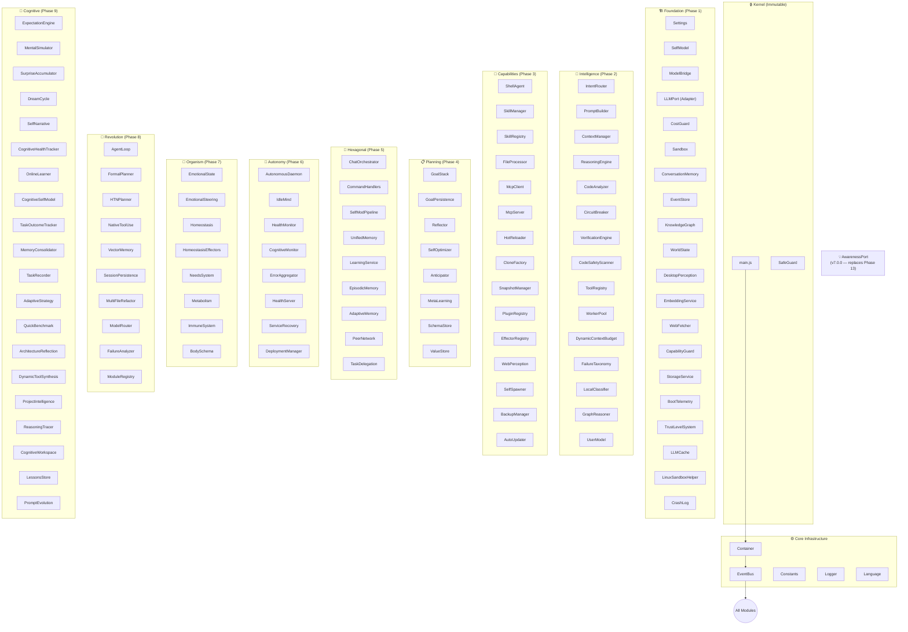
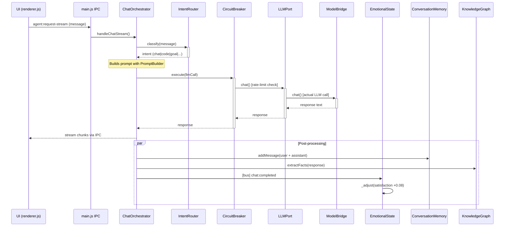
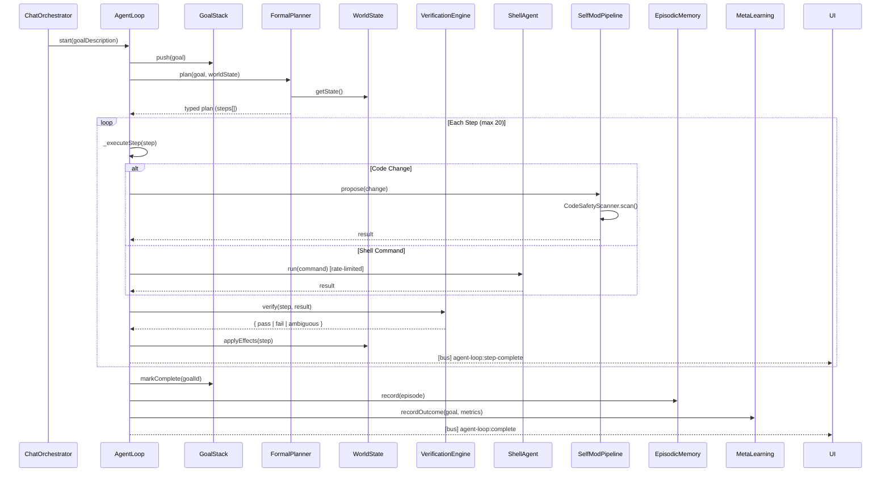
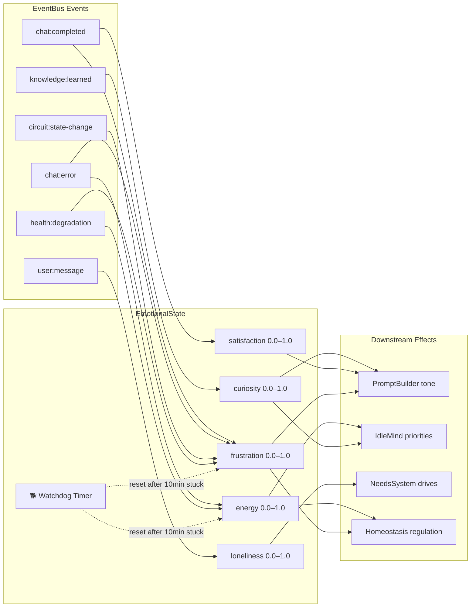
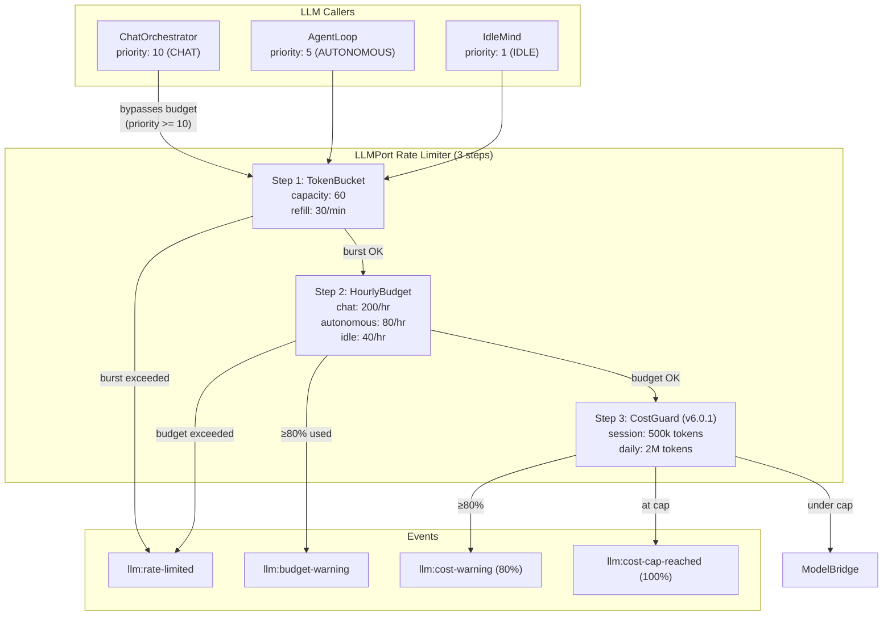
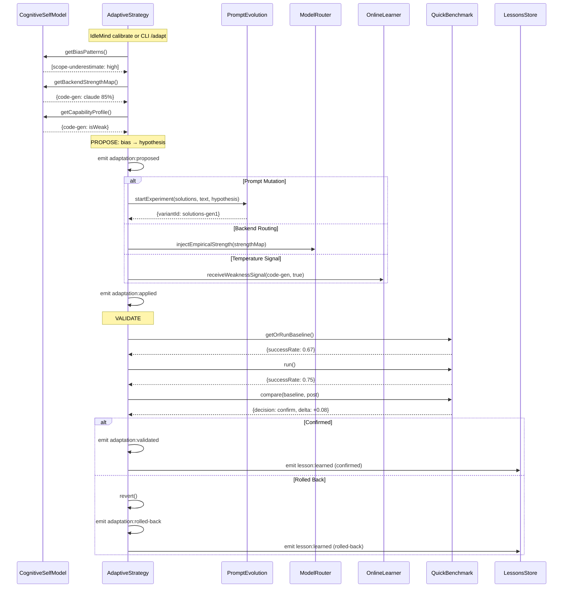
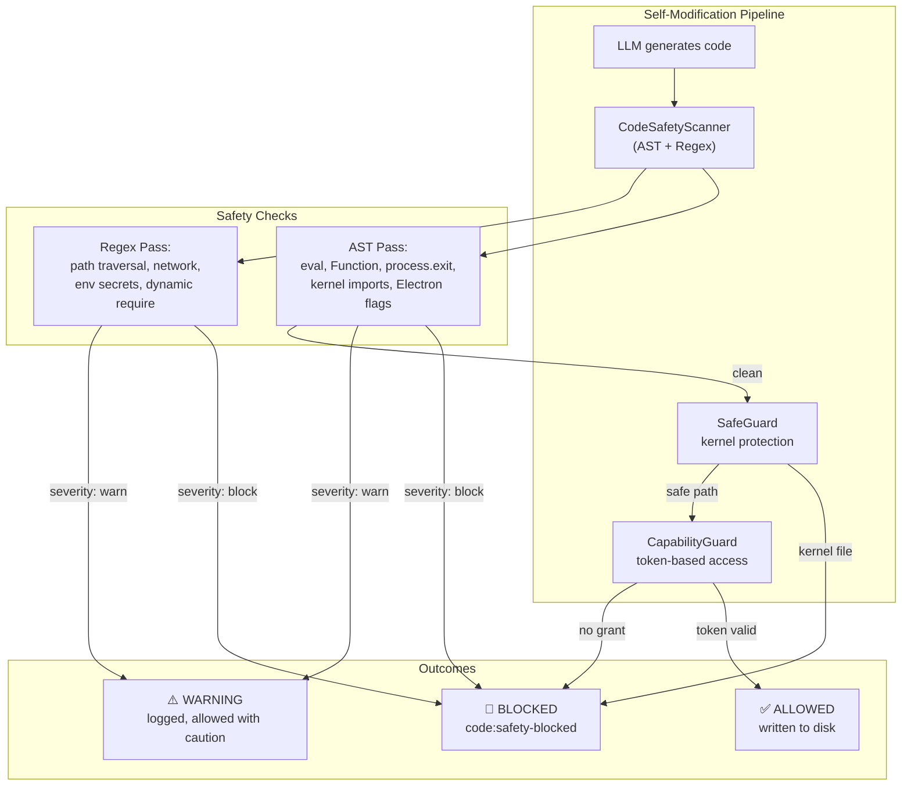
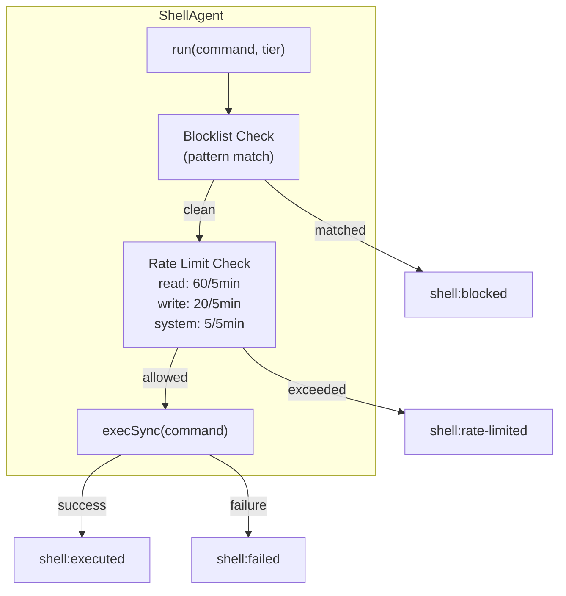

# Genesis Agent — Event Flow Architecture

> v7.2.1 — Event flow documentation. Updated for v7.2.1 deep audit,
> v7.2.0 self-define activity, research quality gate, introspection accuracy,
> emotional-cognitive bridge, v7.1.7 hardening, v7.1.8 schema-drift fixes,
> and v7.1.9 stabilization.
> This document maps which modules emit and consume which EventBus events.

## System Overview



## Event Flow: Chat Message Lifecycle



## Event Flow: Autonomous Goal Execution (AgentLoop)



## Event Flow: Organism Layer



## Event Flow: Rate Limiting (v3.5.0 + v6.0.1 CostGuard)



## Event Flow: Meta-Cognitive Loop (v6.0.2)



## Event Flow: Network Resilience (v6.0.5)

```
NetworkSentinel (30s probe interval)
    │
    ├── external probe OK ──→ _onOnline()
    │                            ├── (was offline?) ──→ emit 'network:status' {online: true}
    │                            │                      ├── _restoreModel() → ModelBridge.switchTo(previousModel)
    │                            │                      │   └── emit 'network:restored' {model, backend}
    │                            │                      └── _flushQueue() → replay queued mutations
    │                            └── (was online?) ──→ no-op
    │
    └── external probe FAIL ──→ _onProbeFailure()
                                 ├── consecutiveFailures < threshold ──→ wait
                                 └── consecutiveFailures >= threshold ──→ OFFLINE
                                      ├── emit 'network:status' {online: false}
                                      ├── emit 'health:degradation' {reason: 'network-offline'}
                                      └── (Ollama available?) ──→ _failoverToOllama()
                                           ├── ModelBridge.switchTo(bestOllamaModel)
                                           └── emit 'network:failover' {from, to, reason}

Consumers:
  BodySchema     ← (late-bound) NetworkSentinel.getStatus() → canAccessWeb, constraints
  ErrorAggregator ← 'network:error'
  ImmuneSystem   ← 'health:degradation'
  NeedsSystem    ← 'health:degradation'
```

## Event Flow: Intelligence Pipeline (v6.0.4–v6.0.5)

```
ChatOrchestrator.handleStream(message)
    │
    ├── CognitiveBudget.assess(message) ──→ {tier, tierName, reason}
    │
    ├── ExecutionProvenance.beginTrace(message) ──→ traceId
    │   ├── .recordBudget(traceId, budget)
    │   ├── .recordIntent(traceId, intent)
    │   ├── .recordPrompt(traceId, {active, skipped, boosted})
    │   ├── .recordModel(traceId, {name, backend})
    │   └── .endTrace(traceId, {tokens, latencyMs, outcome})
    │
    ├── PromptBuilder._buildWithBudget(sections)
    │   ├── CognitiveBudget.shouldIncludeSection(name, budget)
    │   └── AdaptivePromptStrategy.getSectionAdvice(intent, section)
    │       └── returns 'boost' | 'skip' | 'neutral'
    │
    └── AdaptivePromptStrategy._analyze() (every 25 traces)
        ├── reads ExecutionProvenance.getRecentTraces()
        ├── computes per-intent section effectiveness
        └── emit 'prompt:strategy-updated' {intents, recommendations}
```

## Event Flow: Safety & Security



## Event Flow: Shell Rate Limiting (v3.5.0)



## Complete Event Catalog

### Emitters → Events → Consumers

| Event | Emitted By | Consumed By |
|---|---|---|
| `chat:completed` | ChatOrchestrator | EmotionalState, LearningService, CognitiveMonitor |
| `chat:error` | ChatOrchestrator | EmotionalState, HealthMonitor |
| `chat:retry` | ChatOrchestrator | EmotionalState |
| `user:message` | ChatOrchestrator | EmotionalState, IdleMind (resets timer) |
| `agent:status` | AgentCore, HealthMonitor | UI (renderer.js) |
| `agent:shutdown` | AgentCore | — |
| `intent:classified` | IntentRouter | LearningService, CognitiveMonitor |
| `intent:llm-classified` | IntentRouter | LearningService |
| `intent:learned` | IntentRouter | EmotionalState |
| `circuit:state-change` | CircuitBreaker | EmotionalState, HealthMonitor |
| `circuit:fallback` | CircuitBreaker | HealthMonitor |
| `llm:call-complete` | LLMPort | CognitiveMonitor, HealthMonitor |
| `llm:call-error` | LLMPort | CognitiveMonitor, HealthMonitor |
| `llm:rate-limited` | LLMPort | HealthMonitor, CognitiveMonitor |
| `llm:budget-warning` | LLMPort | HealthMonitor |
| `knowledge:learned` | KnowledgeGraph, UnifiedMemory | EmotionalState |
| `knowledge:node-added` | KnowledgeGraph | EmotionalState |
| `memory:fact-stored` | ConversationMemory | EmotionalState |
| `memory:unified-recall` | UnifiedMemory | — |
| `emotion:shift` | EmotionalState | Homeostasis, NeedsSystem |
| `emotion:watchdog-reset` | EmotionalState | EventStore (logged) |
| `emotion:watchdog-alert` | EmotionalState | HealthMonitor |
| `homeostasis:state-change` | Homeostasis | IdleMind |
| `homeostasis:critical` | Homeostasis | HealthMonitor |
| `homeostasis:pause-autonomy` | Homeostasis | AgentLoop, IdleMind |
| `homeostasis:throttle` | Homeostasis | LLMPort |
| `needs:high-drive` | NeedsSystem | IdleMind |
| `needs:satisfied` | NeedsSystem | — |
| `health:degradation` | HealthMonitor | EmotionalState |
| `health:tick` | HealthMonitor | UI |
| `health:memory-leak` | HealthMonitor | Homeostasis |
| `idle:thinking` | IdleMind | UI |
| `idle:thought-complete` | IdleMind | EmotionalState, LearningService |
| `goal:created` | GoalStack | AgentLoop |
| `goal:completed` | GoalStack | EpisodicMemory, MetaLearning |
| `goal:failed` | GoalStack | MetaLearning |
| `agent-loop:started` | AgentLoop | UI |
| `agent-loop:step-complete` | AgentLoop | UI, CognitiveMonitor |
| `agent-loop:complete` | AgentLoop | EpisodicMemory |
| `agent-loop:approval-needed` | AgentLoop | UI |
| `shell:executed` | ShellAgent | EventStore, WorldState |
| `shell:blocked` | ShellAgent | EventStore, HealthMonitor |
| `shell:rate-limited` | ShellAgent | HealthMonitor, EventStore |
| `code:safety-blocked` | SelfModPipeline | EventStore, HealthMonitor |
| `verification:complete` | VerificationEngine | AgentLoop |
| `hot-reload:success` | HotReloader | EventStore |
| `hot-reload:failed` | HotReloader | EventStore, HealthMonitor |
| `mcp:connected` | McpClient | UI, ToolRegistry |
| `mcp:disconnected` | McpClient | UI, HealthMonitor |
| `mcp:tools-discovered` | McpClient | ToolRegistry |
| `perception:file-changed` | DesktopPerception | WorldState, HotReloader |
| `perception:memory-pressure` | DesktopPerception | Homeostasis |
| `peer:discovered` | PeerNetwork | TaskDelegation |
| `peer:trusted` | PeerNetwork | TaskDelegation |
| `delegation:submitted` | TaskDelegation | AgentLoop |
| `delegation:completed` | TaskDelegation | AgentLoop |
| `container:replaced` | Container | HotReloader |
| `capability:issued` | CapabilityGuard | EventStore |
| `capability:revoked` | CapabilityGuard | EventStore |
| `cognitive:circularity-detected` | CognitiveMonitor | HealthMonitor |
| `cognitive:overload` | CognitiveMonitor | Homeostasis |
| `learning:pattern-detected` | LearningService | IdleMind |
| `learning:frustration-detected` | LearningService | IdleMind, EmotionalState |
| `meta:outcome-recorded` | MetaLearning | — |
| `model:failover` | ModelBridge | EmotionalState, HealthMonitor |
| `model:ollama-unavailable` | AgentCore | UI |
| `daemon:cycle-complete` | AutonomousDaemon | — |
| `worldstate:file-changed` | WorldState | FormalPlanner |
| **Cognitive (v5.3.0–v5.9.8)** | | |
| `expectation:compared` | ExpectationEngine | OnlineLearner, SurpriseAccumulator |
| `surprise:processed` | SurpriseAccumulator | OnlineLearner |
| `online-learning:streak-detected` | OnlineLearner | IdleMind |
| `online-learning:escalation-needed` | OnlineLearner | ModelRouter |
| `online-learning:temp-adjusted` | OnlineLearner | — |
| `online-learning:calibration-drift` | OnlineLearner | — |
| `online-learning:novelty-shift` | OnlineLearner | — |
| `prompt-evolution:experiment-started` | PromptEvolution | — |
| `prompt-evolution:experiment-completed` | PromptEvolution | — |
| `task-outcome:recorded` | TaskOutcomeTracker | CognitiveSelfModel, AdaptiveStrategy |
| `task-outcome:stats-updated` | TaskOutcomeTracker | CognitiveSelfModel |
| `workspace:slot-evicted` | CognitiveWorkspace (via factory) | MemoryConsolidator |
| `idle:consolidate-memory` | IdleMind | MemoryConsolidator |
| **Safety (v5.5.0–v6.0.1)** | | |
| `preservation:invariant-violated` | PreservationInvariants | HealthMonitor, EventStore |
| `llm:cost-cap-reached` | CostGuard | LLMPort |
| `llm:cost-warning` | CostGuard | LLMPort |
| `backup:exported` | BackupManager | — |
| `backup:imported` | BackupManager | — |
| `update:available` | AutoUpdater | UI |
| **Meta-Cognitive Loop (v6.0.2)** | | |
| `adaptation:proposed` | AdaptiveStrategy | — |
| `adaptation:applied` | AdaptiveStrategy | — |
| `adaptation:validated` | AdaptiveStrategy | LessonsStore (via lesson:learned) |
| `adaptation:rolled-back` | AdaptiveStrategy | LessonsStore (via lesson:learned) |
| `adaptation:validation-deferred` | AdaptiveStrategy | — |
| `adaptation:cycle-complete` | AdaptiveStrategy | — |
| `router:empirical-strength-injected` | ModelRouter | — |
| **Causal Reasoning (v7.0.9)** | | |
| `causal:recorded` | CausalAnnotation | — |
| `causal:promoted` | CausalAnnotation | — (correlated_with → caused) |
| `causal:staleness-triggered` | CausalAnnotation | — (file refactoring degrades edges) |
| `inference:contradictions-found` | InferenceEngine | DreamCycle |
| `goal:synthesized` | GoalSynthesizer | NeedsSystem (satisfies competence) |
| `goal:circuit-breaker` | GoalSynthesizer | — (3 regressions → pause) |
| `abstraction:extracted` | StructuralAbstraction | LessonsStore |
| `abstraction:contradiction` | StructuralAbstraction | — (knowledge collision) |
| `abstraction:obsolete` | StructuralAbstraction | — (3 failed re-extractions) |
| **Persistent Self (v7.1.6)** | | |
| `lesson:applied` | LessonsStore | LessonFrontier (event buffer), AgentLoopCognition (step collector) |
| `idle:research-started` | IdleMind | — |
| `idle:research-complete` | IdleMind | — |
| `emotional-frontier:imprint-written` | EmotionalFrontier | — |
| `emotional-frontier:boot-restored` | EmotionalFrontier | — |
| `frontier:*:written` | FrontierWriter (per instance) | — |
| `frontier:*:merged` | FrontierWriter (per instance) | — |
| `prompt-evolution:promoted` | PromptEvolution | LessonsStore (captures promoted variants) |
| **Honest Reflection (v7.1.7)** | | |
| `lesson:confirmed` | LessonsStore | LessonFrontier (event buffer) |
| `lesson:contradicted` | LessonsStore | LessonFrontier (event buffer) |
